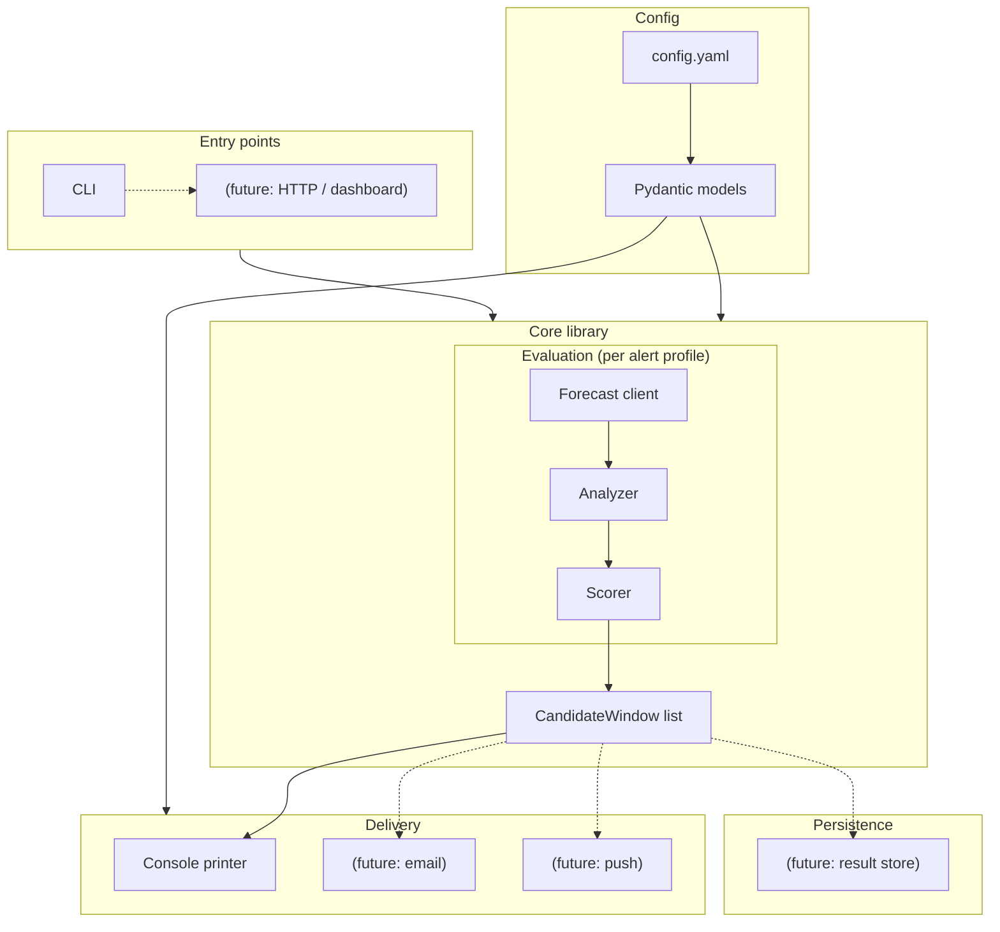
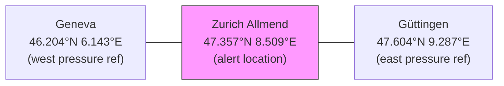
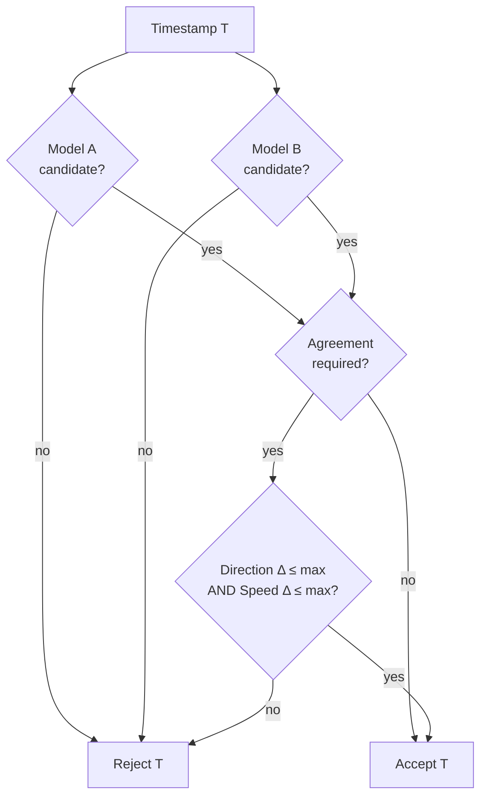
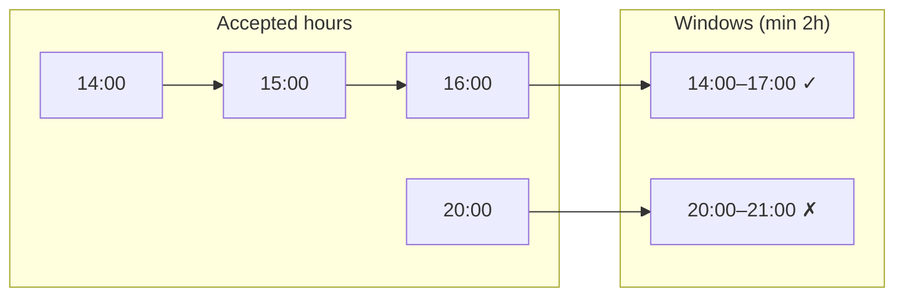
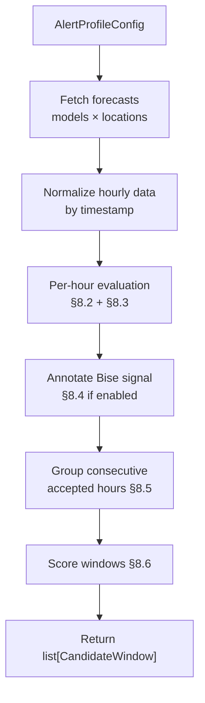
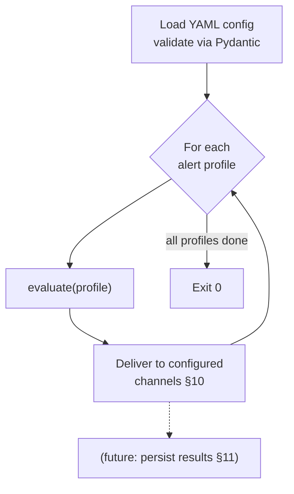
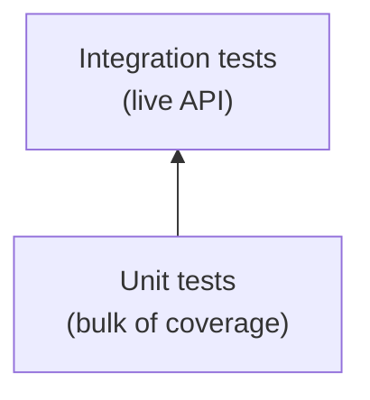

# Paragliding Conditions Alert System 

PoC use Case: Zurich Bise / Ground Handling

## 1. Overview

The wind alert system evaluates weather forecasts to identify favorable wind windows and deliver scored alerts. The architecture is organized around three independent concerns — **evaluation**, **persistence**, and **delivery** — so that new alert profiles, storage backends, and notification channels can be added without restructuring the core.

The POC ships with a single alert profile (Zurich Bise ground-handling), no persistence, and console output only.

### Key Characteristics

| Attribute | Value |
|---|---|
| Forecast horizon | Per-alert, default 48 h rolling |
| Wind level | Per-alert, default 10 m above ground |
| Models compared | Per-alert, default 2 |
| Configuration format | YAML file parsed into Pydantic models |
| Extensibility points | Alert profiles, delivery channels, persistence backends, entry points |

---

## 2. Architecture

### 2.1 Layer Diagram



### 2.2 Separation of Concerns

| Layer | Responsibility | POC implementation |
|---|---|---|
| **Config** | Load, validate, and provide typed settings | YAML → Pydantic `BaseModel` tree |
| **Forecast client** | Fetch and normalize weather data from upstream API | Open-Meteo via `httpx` |
| **Analyzer** | Per-hour candidate evaluation, model agreement, Bise signal | Pure functions over normalized data |
| **Scorer** | Window grouping + confidence scoring | Pure functions |
| **Delivery** | Format and emit results to one or more channels | Console (`rich`) |
| **Persistence** | Store and query historical results | None (future) |
| **Entry point** | Accept invocation, call core, route output | CLI (`click`) |

The analyzer and scorer operate on typed data models, not raw API responses. The forecast client is the only component with network I/O.

### 2.3 Core as a Library

The evaluation pipeline is a **library function**, not a script. Its public surface is a single call:

```
evaluate(profile: AlertProfileConfig) -> list[CandidateWindow]
```

This function fetches forecasts, runs analysis, groups windows, scores them, and returns the result. It has no side effects — no printing, no persistence, no delivery. The caller decides what to do with the results.

The POC entry point is a CLI that loops over configured profiles, calls `evaluate`, and passes results to delivery channels. A future web dashboard is a second entry point that calls the same `evaluate` function and returns JSON over HTTP. Neither entry point needs to change the other.

### 2.4 Key Abstractions

**`AlertProfile`** — a named bundle of: location, wind/direction/dry thresholds, model list, optional pressure-gradient references, scoring parameters, and delivery channel references. The config file contains a list of these; the POC ships one.

**`CandidateWindow`** — the output of evaluation. Carries all scored data and a reference to the alert profile that produced it. Delivery, persistence, and API responses all consume this model. Because it is a Pydantic `BaseModel`, it serializes to JSON/dict natively for HTTP responses.

**`DeliveryChannel`** — a protocol (abstract base) that accepts a list of `CandidateWindow` objects and emits them. The POC implements `ConsoleChannel`. Future channels (email, push, webhook) implement the same interface.

**`ResultStore`** — a protocol for persisting and querying `CandidateWindow` history. Not implemented in the POC; the evaluation pipeline calls it optionally when configured.

---

## 3. Data Source

The system consumes the **Open-Meteo Forecast API** (`api.open-meteo.com/v1/forecast`). Open-Meteo is keyless for non-commercial use and exposes per-model forecasts, allowing direct multi-model comparison from a single provider.

### Weather Variables

| Variable | Used by | Notes |
|---|---|---|
| `wind_speed_{level}m` | Wind filter | Unit: km/h. Level from alert config (default 10) |
| `wind_direction_{level}m` | Direction filter | Meteorological degrees. Level from alert config |
| `precipitation` | Dry filter (optional) | mm/h |
| `pressure_msl` | Bise gradient | Preferred over surface pressure to avoid elevation bias |

All requests specify `timezone=Europe/Zurich` and `wind_speed_unit=kmh`. Three forecast days are fetched; only the configured `forecast_hours` are evaluated.

---

## 4. Forecast Models

Each alert profile references a list of models. The POC Zurich profile uses two:

| Role | Default model ID | Coverage |
|---|---|---|
| Primary | `icon_ch2` | MeteoSwiss high-resolution ICON (Switzerland) |
| Secondary | `icon_d2` | DWD ICON-D2 (Central Europe) |

Model IDs are configurable per profile. Invalid IDs propagate the upstream API error.

---

## 5. Locations

Each alert profile defines its own alert location plus optional pressure-gradient references. The POC profile uses three locations:



| Location | Role | Default coords |
|---|---|---|
| Zurich / Allmend | Wind condition detection | 47.357 N, 8.509 E |
| Geneva | Western pressure reference | 46.204 N, 6.143 E |
| Güttingen (Lake Constance) | Eastern pressure reference | 47.604 N, 9.287 E |

The east–west pressure pair spans the Swiss Plateau, the corridor along which Bise develops. Alert profiles that do not need a pressure-gradient check omit the reference locations.

---

## 6. API Request Strategy

One request per (model × location) within an alert profile. For the POC profile this yields up to 6 calls:

| Location | Variables requested |
|---|---|
| Zurich (alert) | `wind_speed_{level}m`, `wind_direction_{level}m`, `precipitation`, `pressure_msl` |
| Geneva (west ref) | `pressure_msl` |
| Güttingen (east ref) | `pressure_msl` |

Responses are keyed by `hourly.time` timestamps; no positional assumptions.

---

## 7. Configuration

All tunables live in a YAML config file, loaded into a tree of Pydantic `BaseModel` classes. The top-level structure is a list of alert profiles plus shared defaults.

### 7.1 Config Structure

```yaml
defaults:
  forecast_hours: 48
  wind_level_m: 10
  model_agreement:
    required: true
    min_models_matching: 2
    max_direction_delta_deg: 35
    max_speed_delta_kmh: 8.0

alerts:
  - name: zurich_bise
    description: "NE/E wind for ground handling — Zurich Allmend"

    location:
      name: zurich_allmend
      latitude: 47.357
      longitude: 8.509

    models:
      - icon_ch2
      - icon_d2

    wind_level_m: 10  # Open-Meteo wind height in metres (10, 80, 120, …)

    wind:
      min_speed_kmh: 8.0
      strong_speed_kmh: 10.0
      direction_min_deg: 30
      direction_max_deg: 100
      min_consecutive_hours: 2

    time_window:
      start_hour: 8   # local time (Europe/Zurich), inclusive
      end_hour: 20     # exclusive — only consider 08:00–19:59

    dry:
      enabled: false
      max_precipitation_mm_per_hour: 0.2

    bise:
      enabled: true
      east_minus_west_pressure_hpa_min: 1.5
      boost_if_bise: true
      pressure_reference_west:
        name: geneva
        latitude: 46.204
        longitude: 6.143
      pressure_reference_east:
        name: guettingen
        latitude: 47.604
        longitude: 9.287

    delivery:
      - console

# Future: additional alerts with different locations/conditions
# - name: interlaken_thermal
#   location: ...
#   wind: ...
#   delivery: [console, email]

delivery_channels:
  console:
    type: console
  # Future channels:
  # email:
  #   type: email
  #   to: ...
  # push:
  #   type: push
  #   endpoint: ...

# persistence:
#   type: none
```

### 7.2 Pydantic Model Hierarchy

```
AppConfig
├── defaults: DefaultsConfig
│   ├── forecast_hours: int
│   ├── wind_level_m: int
│   └── model_agreement: ModelAgreementConfig
├── alerts: list[AlertProfileConfig]
│   ├── name: str
│   ├── location: LocationConfig
│   ├── models: list[str]
│   ├── wind_level_m: int | None  (overrides default)
│   ├── wind: WindConfig
│   ├── time_window: TimeWindowConfig | None
│   ├── dry: DryConfig | None
│   ├── bise: BiseConfig | None
│   │   ├── pressure_reference_west: LocationConfig
│   │   └── pressure_reference_east: LocationConfig
│   └── delivery: list[str]
└── delivery_channels: dict[str, DeliveryChannelConfig]
```

Alert-level settings override defaults where applicable. Each alert profile is self-contained: a second alert can use completely different locations, models, direction ranges, and delivery channels.

### 7.3 Design Rationale (POC defaults)

- **8 km/h minimum** — low threshold to catch marginal-but-useful sessions.
- **10 km/h strong** — the "good session" marker.
- **30°–100° direction band** — wide enough to avoid missing rotated Bise days.
- **2-hour minimum window** — filters out transient gusts.
- **08:00–20:00 time window** — ground handling is a daytime activity; nighttime matches are not useful.

---

## 8. Algorithms

### 8.1 Wind Direction Helpers

Wind direction uses meteorological convention (0° = north, 90° = east, clockwise). Two circular-arithmetic utilities are needed:

**Range check** — determines whether a direction falls inside `[min_deg, max_deg]`. When `min ≤ max`, a simple bounds check applies. When the range wraps through north (e.g. 350°–30°), the test becomes `direction ≥ min OR direction ≤ max`.

**Angular distance** — the shortest arc between two bearings: `min(|a − b| mod 360, 360 − |a − b| mod 360)`.

### 8.2 Per-Hour Candidate Evaluation

For a single model at a single timestamp, the hour is a candidate if **all** of:

1. If `time_window` is configured: the timestamp's local hour (Europe/Zurich) is within `[start_hour, end_hour)`. Hours outside this range are rejected before any weather checks.
2. `wind_speed ≥ min_speed_kmh` (at the alert's configured wind level)
3. `wind_direction` falls within `[direction_min_deg, direction_max_deg]` (circular)
4. If the dry filter is enabled: `precipitation ≤ max_precipitation_mm_per_hour`

### 8.3 Multi-Model Agreement

Each timestamp is evaluated independently per model. A timestamp is **accepted** when:

1. At least `min_models_matching` models mark it as a candidate (§8.2).
2. If `model_agreement.required`, the models must additionally agree:
   - Angular distance between directions ≤ `max_direction_delta_deg`
   - Absolute speed difference ≤ `max_speed_delta_kmh`



### 8.4 Pressure Gradient — Bise Signal

For each timestamp and each model:

$$\Delta P = P_{\text{msl,east}} - P_{\text{msl,west}}$$

A positive $\Delta P$ indicates higher pressure to the east, consistent with Bise. The signal is considered present when **both** models show $\Delta P \geq$ `east_minus_west_pressure_hpa_min` (default 1.5 hPa).

The Bise signal acts as a **confidence booster** in scoring, not a hard gate. The 10 m wind forecast already captures most Bise-driven surface wind; the gradient adds confirmation and reduces false positives.

Bise configuration (including pressure references) is optional per alert profile. Profiles that omit the `bise` section skip this step entirely.

### 8.5 Window Grouping

Accepted timestamps are sorted chronologically and merged into contiguous runs. Only runs with duration ≥ `min_consecutive_hours` survive as candidate windows.



### 8.6 Scoring

Each candidate window receives a confidence score (0–7 scale):

| Factor | Condition | Points |
|---|---|---|
| Wind strength | avg speed ≥ 10 km/h | +2 |
| | avg speed ≥ 8 km/h | +1 |
| Duration | ≥ 4 hours | +2 |
| | ≥ 2 hours | +1 |
| Bise pressure | gradient ≥ 3.0 hPa | +2 |
| | gradient ≥ 1.5 hPa | +1 |
| Dry conditions | enabled and precip ≤ 0.2 mm/h | +1 |

Classification:

| Score | Label |
|---|---|
| 0–2 | Weak candidate |
| 3–4 | Candidate |
| 5+ | Strong candidate |

Windows with score ≥ 3 are emitted as alerts.

---

## 9. Domain Models

All domain objects are Pydantic `BaseModel` subclasses. The key runtime models:

### `HourForecast`

| Field | Type | Description |
|---|---|---|
| `time` | `datetime` | Timestamp (Europe/Zurich) |
| `wind_speed` | `float \| None` | km/h (fetched at configured wind level) |
| `wind_direction` | `float \| None` | Meteorological degrees (fetched at configured wind level) |
| `precipitation` | `float \| None` | mm/h |
| `pressure_msl` | `float \| None` | hPa |

### `CandidateWindow`

| Field | Type | Description |
|---|---|---|
| `alert_name` | `str` | Owning alert profile name |
| `start` | `datetime` | Window start (inclusive) |
| `end` | `datetime` | Window end (exclusive) |
| `duration_hours` | `int` | Number of matching hours |
| `avg_wind_speed_kmh` | `float` | Mean wind speed across models/hours |
| `max_wind_speed_kmh` | `float` | Peak wind speed |
| `avg_direction_deg` | `float` | Mean wind direction |
| `bise_pressure_gradient_hpa` | `float \| None` | Mean east−west gradient (if bise enabled) |
| `models` | `list[str]` | Contributing model IDs |
| `dry_filter_applied` | `bool` | Whether dry filter was active |
| `score` | `int` | Confidence score |
| `classification` | `str` | weak / candidate / strong |

`CandidateWindow` is the unit of exchange between evaluation, delivery, and (future) persistence. Every downstream consumer depends only on this model.

---

## 10. Delivery

### 10.1 Channel Protocol

All delivery channels implement a common interface:

```
deliver(alert_name, windows: list[CandidateWindow]) -> None
```

The runner iterates configured channels for each alert profile and calls `deliver`. Channels are stateless; they receive everything they need as arguments.

### 10.2 Console Channel (POC)

Prints a human-readable summary to stdout via `rich`.

#### Candidates Found

```text
Wind Alert Candidates — Zurich / Allmend
Forecast horizon: next 48h
Models: icon_ch2 + icon_d2

STRONG CANDIDATE
Tue 2026-04-28 14:00–17:00
Duration: 3h
Wind: avg 11.2 km/h, max 14.8 km/h
Direction: avg 72° ENE
Bise pressure gradient: +2.4 hPa east−west
Dry filter: disabled
Score: 5 / 7
```

#### No Candidates

```text
No candidate NE/E wind windows found in the next 48h.
```

### 10.3 Future Channels

New channels (email, push notification, webhook) are added by:
1. Creating a new class implementing the channel protocol.
2. Registering a `type` key in `delivery_channels` config.
3. Referencing that key in an alert profile's `delivery` list.

No changes to evaluation or scoring logic.

---

## 11. Persistence (Future)

Not implemented in the POC. The extension point is a `ResultStore` protocol:

```
save(windows: list[CandidateWindow]) -> None
query(alert_name, since: datetime) -> list[CandidateWindow]
```

When a store is configured, the runner calls `save` after evaluation. This enables:
- Deduplication (suppress re-alerting for already-seen windows)
- Trend analysis (compare forecast accuracy over time)
- History display

The store implementation (SQLite, file-based, remote) is determined by the `persistence.type` config key.

---

## 12. Program Flow

### 12.1 Core Evaluation (library)



### 12.2 CLI Entry Point (POC)



The `evaluate` function is the sole interface between entry points and business logic. The CLI calls it in a loop; a future HTTP handler calls it on demand for a single profile and returns the `CandidateWindow` list as JSON.

---

## 13. Testing Strategy

### 13.1 Test Pyramid



All tests use **pytest**. Unit tests run offline and fast; integration tests hit the live Open-Meteo API and are marked so they can be skipped in CI.

### 13.2 Unit Tests

Unit tests cover all pure logic with no network I/O. Forecast data is constructed in-memory as `HourForecast` model instances.

| Area | What to verify |
|---|---|
| **Direction helpers** | `direction_in_range` for normal ranges, wrap-through-north ranges, boundary values. `angular_distance` symmetry, 0°/360° equivalence, opposite bearings = 180°. |
| **Per-hour candidate** | Accepts when speed + direction + precip all pass. Rejects on each individual filter. Dry filter ignored when disabled. |
| **Model agreement** | Accepts when both models pass and deltas within limits. Rejects when direction delta or speed delta exceeds threshold. Bypass when `required = false`. |
| **Bise signal** | Positive gradient detected. Below-threshold gradient rejected. Missing pressure gracefully returns `None`. |
| **Window grouping** | Consecutive hours merge. Gaps split. Single-hour windows filtered by `min_consecutive_hours`. Empty input returns no windows. |
| **Scoring** | Score boundaries for each factor. Classification labels at 0, 2, 3, 4, 5, 7. |
| **Config validation** | Valid YAML parses. Missing required fields raise `ValidationError`. Alert-level overrides take precedence over defaults. |
| **Vector-average direction** | Known angles produce correct mean. Wrap-around averaging (e.g. 350° + 10° → 0°). |

### 13.3 Integration Tests

Integration tests make real HTTP calls to Open-Meteo to verify the forecast client against the live API. They are marked with `@pytest.mark.integration` so they can be selected or excluded:

```
uv run pytest -m integration        # only integration
uv run pytest -m "not integration"   # skip integration
```

| Test | What to verify |
|---|---|
| **Single-location fetch** | Request for Zurich with one model returns hourly data containing the expected variable keys and plausible value ranges. |
| **Multi-model fetch** | Two models for the same location return data keyed by the same timestamps. |
| **Pressure-only fetch** | Pressure reference request returns `pressure_msl` for each hour. |
| **Invalid model ID** | Request with a bogus model name propagates an error (non-200 or error JSON). |
| **Response normalization** | Raw API JSON parses into `HourForecast` models with correct types and timezone. |
| **End-to-end single profile** | Run the full evaluation pipeline for the POC Zurich profile against live data; assert the result is a (possibly empty) list of `CandidateWindow` with valid field types and score ranges. |

Integration tests assert **structural correctness** (keys exist, types match, values in sane ranges) rather than specific weather values, since forecasts change continuously.

---

## 14. Implementation Notes

### Average wind direction

Do not use arithmetic mean for directions.

Use vector average:

```python
sin_sum = sum(math.sin(math.radians(d)) for d in directions)
cos_sum = sum(math.cos(math.radians(d)) for d in directions)
avg = math.degrees(math.atan2(sin_sum, cos_sum))
avg = (avg + 360) % 360
```

### Missing data

If either model is missing wind data for an hour, reject that hour.

If pressure data is missing, still allow wind alert but mark:

```text
Bise pressure gradient: unavailable
```

### Forecast horizon

Evaluate only:

```python
now <= timestamp <= now + 48h
```

Use local Zurich timezone.

---

## 15. POC Scope

The POC delivers:

1. A single alert profile (Zurich Bise ground-handling).
2. Console delivery channel only.
3. No persistence.
4. No scheduler — single invocation via CLI.
5. CLI is the only entry point.

Future additions extend via the abstractions defined in §2 without restructuring the core:

| Extension | What changes | What stays |
|---|---|---|
| More alert profiles | Add entries to `alerts` list in config | Core, delivery, CLI |
| Email / push delivery | New `DeliveryChannel` implementation + config | Core, CLI |
| Persistence | New `ResultStore` implementation + config | Core, delivery |
| Web dashboard | New HTTP entry point calling `evaluate()`, serving `CandidateWindow` as JSON | Core, delivery, config |
8. Program exits cleanly with sensible error messages
